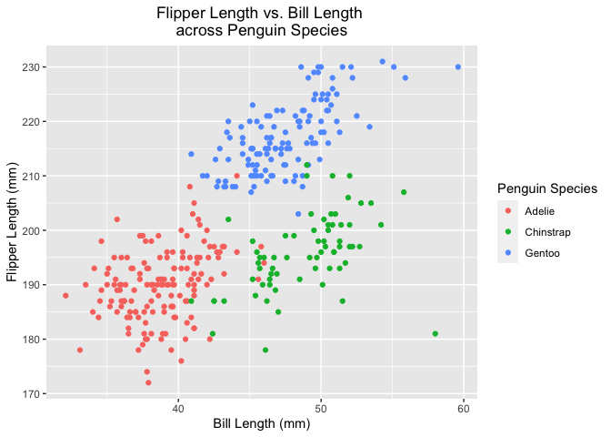

Homework 1
================
Philip Kim
9/22/2021

-   [Problem 1](#problem-1)
    -   [Part 1 - Data Frame Creation](#part-1---data-frame-creation)
    -   [Part 2 - Variable Means](#part-2---variable-means)
    -   [Part 3 - Coercion](#part-3---coercion)
-   [Problem 2](#problem-2)
    -   [Part 1 - Penguin Dataset
        Description](#part-1---penguin-dataset-description)
    -   [Part 2 - Scatterplot](#part-2---scatterplot)

``` r
library(tidyverse)
library(knitr)
```

# Problem 1

## Part 1 - Data Frame Creation

Create a data frame comprised of:

1.  a random sample of size 10 from a standard Normal distribution
2.  a logical vector indicating whether elements of the sample are
    greater than 0
3.  a character vector of length 10
4.  a factor vector of length 10, with 3 different factor “levels”

``` r
set.seed(1)

problem1_df = 
  tibble(
  sample = rnorm(10),
  lrgr_than_0 = sample > 0,
  vec_char = c("a", "b", "c", "d", "e", "f", "g", "h", "i", "j"),
  vec_factor = factor(c("low", "medium", "high", "medium", "high", "low", "low", "medium", "high", "high"))
)

kable(problem1_df, caption = "Problem 1 Dataframe")
```

|     sample | lrgr_than_0 | vec_char | vec_factor |
|-----------:|:------------|:---------|:-----------|
| -0.6264538 | FALSE       | a        | low        |
|  0.1836433 | TRUE        | b        | medium     |
| -0.8356286 | FALSE       | c        | high       |
|  1.5952808 | TRUE        | d        | medium     |
|  0.3295078 | TRUE        | e        | high       |
| -0.8204684 | FALSE       | f        | low        |
|  0.4874291 | TRUE        | g        | low        |
|  0.7383247 | TRUE        | h        | medium     |
|  0.5757814 | TRUE        | i        | high       |
| -0.3053884 | FALSE       | j        | high       |

Problem 1 Dataframe

## Part 2 - Variable Means

Try to take the mean of each variable in your dataframe. What works and
what doesn’t?

``` r
  mean(pull(problem1_df, sample))
```

    ## [1] 0.1322028

``` r
  mean(pull(problem1_df, lrgr_than_0))
```

    ## [1] 0.6

``` r
  mean(pull(problem1_df, vec_char))
```

    ## Warning in mean.default(pull(problem1_df, vec_char)): argument is not numeric or
    ## logical: returning NA

    ## [1] NA

``` r
  mean(pull(problem1_df, vec_factor))
```

    ## Warning in mean.default(pull(problem1_df, vec_factor)): argument is not numeric
    ## or logical: returning NA

    ## [1] NA

After calculating the means of all four variables in the data frame, the
mean was calculated for the random sample and the logical vector.
However, it did not work for the character vector or the factor vector.
It displayed that the “argument is not numeric or logical: returning
NA”.

## Part 3 - Coercion

In some cases, you can explicitly convert variables from one type to
another. Write a code chunk that applies the as.numeric function to the
logical, character, and factor variables (please show this chunk but not
the output). What happens, and why? Does this help explain what happens
when you try to take the mean?

``` r
  as.numeric(pull(problem1_df, lrgr_than_0))
  as.numeric(pull(problem1_df, vec_char))
  as.numeric(pull(problem1_df, vec_factor))
```

The `as.numeric` function changed the outputs of the logical vector into
0’s which corresponded to False values and 1’s which corresponded to
True values. Accordingly, the character vector was changed into “NA”’s
and the factor vector was changed into numbers 1, 2, and, 3 that
corresponded to the different levels. These numbers were assigned
alphabetically where the level “high” corresponded to 1, “low”
corresponded to 2, and “medium” corresponded to 3. Yes, it does help
explain because you can not get the mean of “NA” outputs and the factor
levels are treated as categorical data which you can not calculate the
mean for.

# Problem 2

``` r
  data("penguins", package = "palmerpenguins")
```

## Part 1 - Penguin Dataset Description

Write a short description of the penguins dataset (not the penguins_raw
dataset) using inline R code, including:

1.  the data in this dataset, including names / values of important
    variables
2.  the size of the dataset (using nrow and ncol)
3.  the mean flipper length

In this dataset, it includes important information of the penguins which
include the `species` of the penguin (3 in total), the `island` they are
from, the bill dimensions such as `bill_length_mm` and `bill_depth_mm`,
body mass (g), and the `sex` of the penguins. Moreover, there are 344
penguins represented in this dataset with 8 different variables
describing each penguin listed. Accordingly, the mean flipper length of
all the penguins listed is 200.92mm.

``` r
  mean(as.double(pull(penguins, flipper_length_mm)), na.rm = TRUE)
```

    ## [1] 200.9152

## Part 2 - Scatterplot

Make a scatterplot of flipper_length_mm (y) vs bill_length_mm (x); color
points using the species variable.

``` r
  ggplot(penguins, aes(x = bill_length_mm, y = flipper_length_mm, color = species)) + labs(x = "Bill Length (mm)", y = "Flipper Length (mm)") + ggtitle("Flipper Length vs. Bill Length \nacross Penguin Species") + labs(colour = "Penguin Species") + theme(plot.title = element_text(hjust = 0.5)) + geom_point()
```

<!-- -->

``` r
  ggsave("penguins_scatterplot.pdf", height = 4, width = 6)
```
